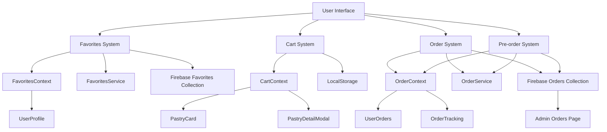
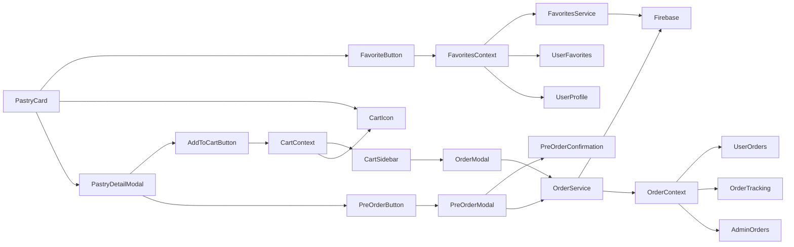
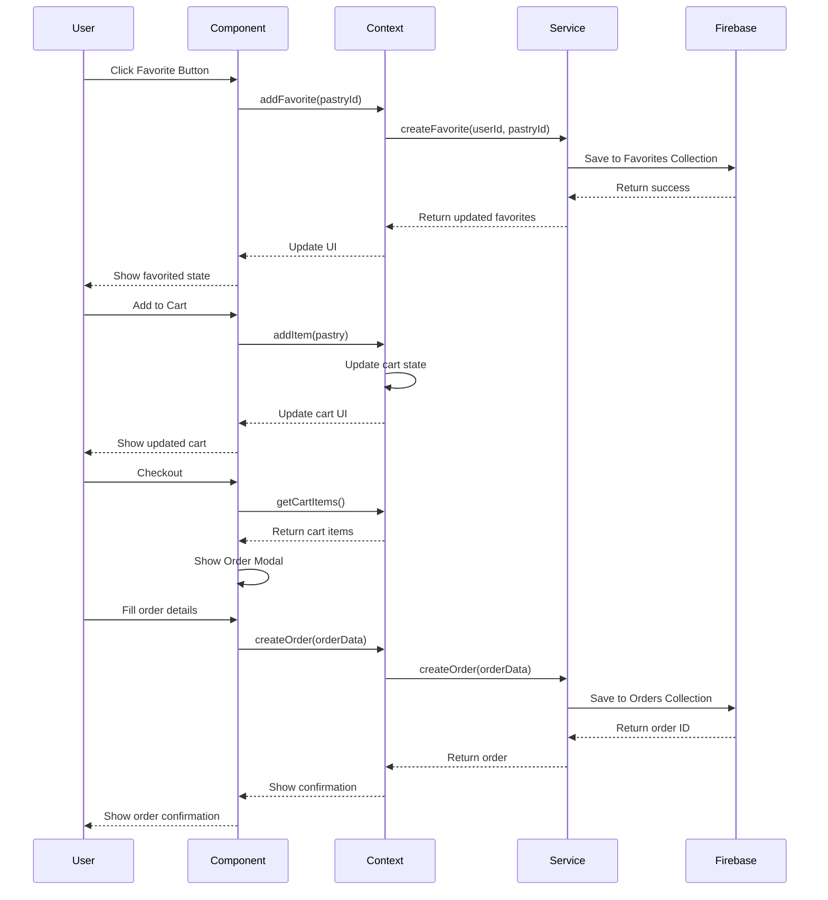
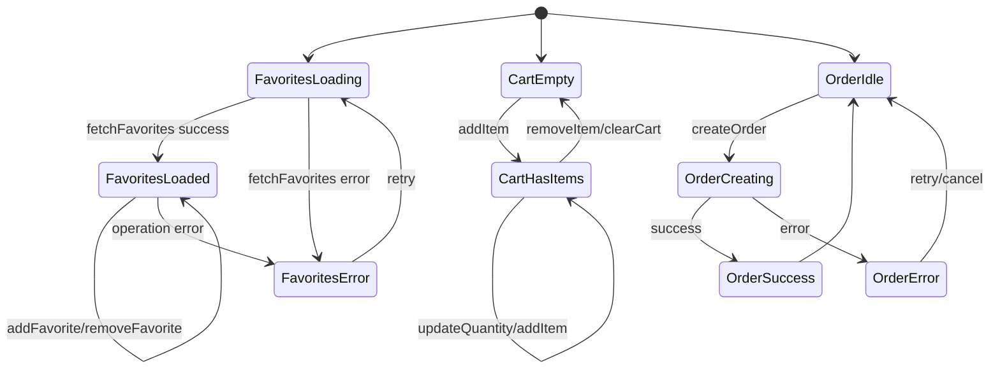
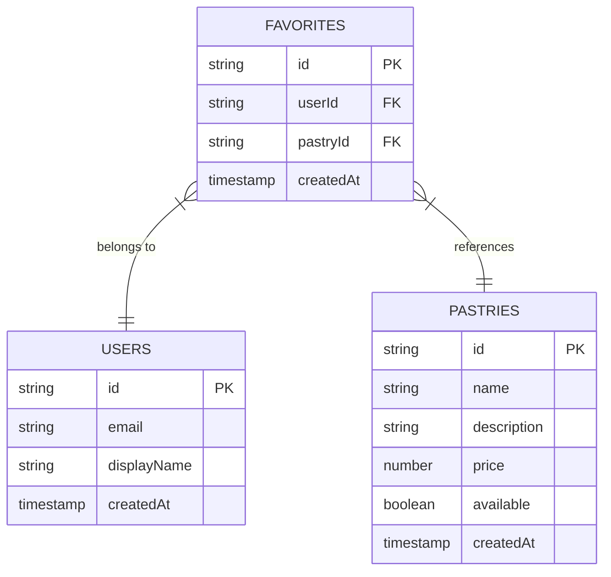
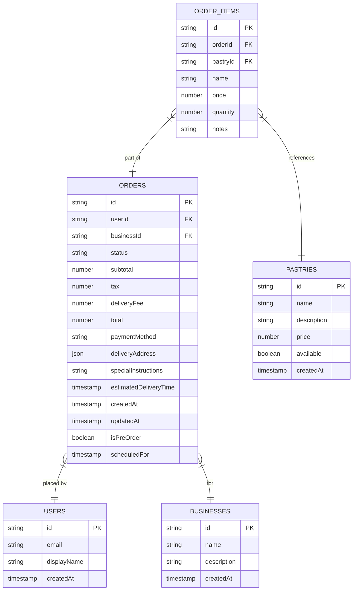
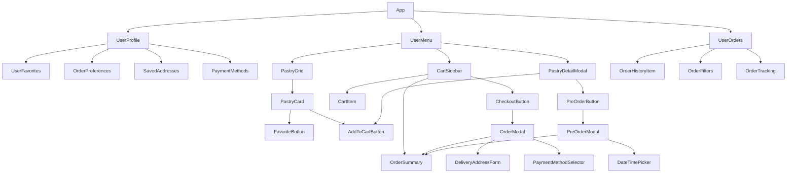

# User Features Architecture

## System Architecture Overview

## Component Relationships

## Data Flow Diagram

## State Management Flow

## Firebase Schema

### Favorites Collection

### Orders Collection

## Component Hierarchy

This architecture provides a comprehensive overview of how the user features will be implemented, including the relationships between components, data flow, state management, and Firebase schema.